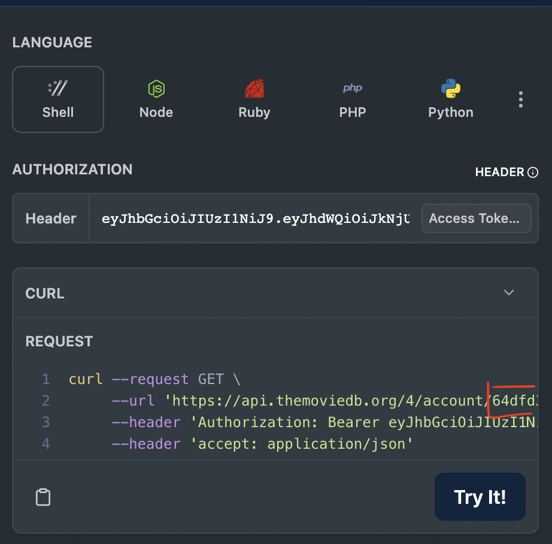
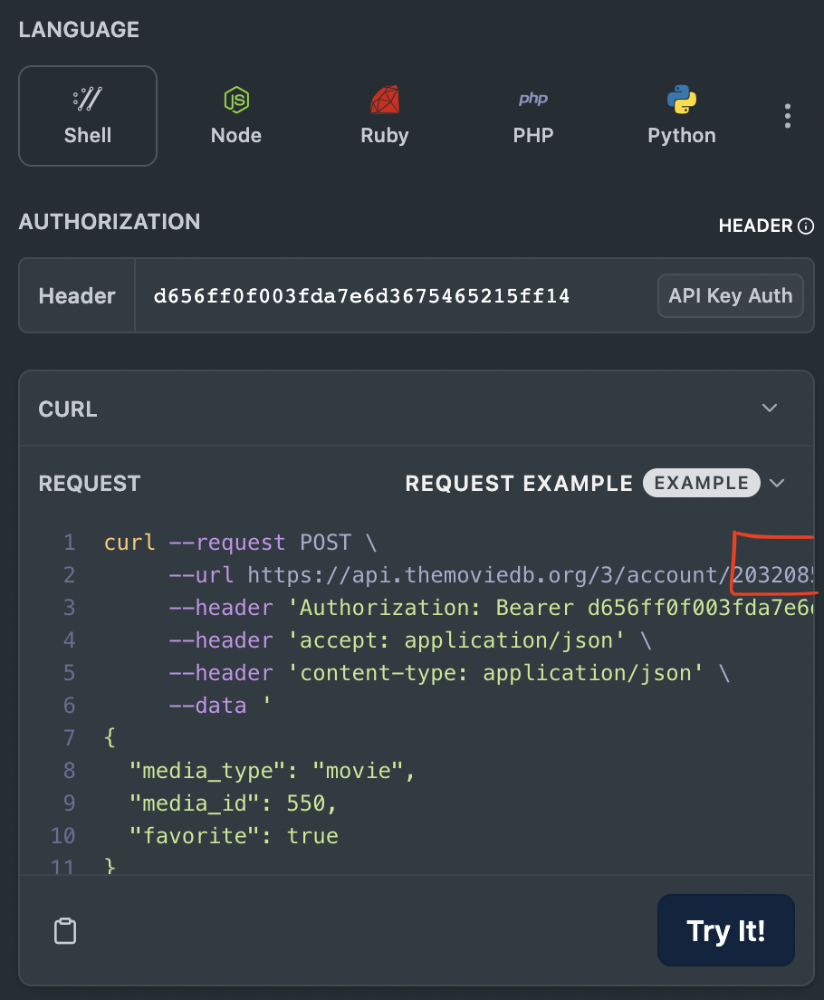

# TMDB Movie App

## Este é um app de filmes!

## App overview 📱
### Você pode ver uma prévia do app [AQUI](https://drive.google.com/file/d/1Fu87VxITGFPnTyxeiIOQ7Aitc0RScDwE/view?usp=sharing)
## Test User
> usuário: user
>
> senha: 123


## Stack 📚

- [[React Native]](https://reactnative.dev/) - Core Framework;
- [[zustand]](https://github.com/pmndrs/zustand) - Global management store;
- [[React Hook Forms]](https://www.react-hook-form.com/) - Forms with React Native;
- [[Axios]](https://github.com/axios/axios) -  Promise-based HTTP Client;
- [[TMDB API]](https://www.themoviedb.org/settings/api) - Movies API Database
- [[React Native Test Library]](https://callstack.github.io/react-native-testing-library/) - Tests Lib

## .env ⚙️
renomeie o arquivo  ".env.example" para ".env"

```
REACT_APP_IMAGE_PATH="https://image.tmdb.org/t/p/w500/"
API_KEY=
API_TOKEN=
ACCOUNT_ID=
ACCOUNT_NUMBER=
```

1 - Crie sua conta e solicite sua chave de API [aqui](https://www.themoviedb.org/settings/api)

2 - Após criar você terá acesso sua API_KEY e API_TOKEN respectivamente


3 - Seu ACCOUNT_ID pode ser encontrado [aqui](https://developer.themoviedb.org/v4/reference/account-favorite-movies)



4 - Seu ACCOUNT_NUMBER pode ser encontrado [aqui](https://developer.themoviedb.org/reference/account-add-favorite)



5 - Substitua os valores no arquivo .env e builde o app


## Buildando ⚙️
### Rodando no iOS
```sh
yarn && cd ios && pod install && cd .. && yarn ios
```

### Rodando no Android
```sh
yarn && yarn ios
```

## Testes

```sh
yarn test
```
